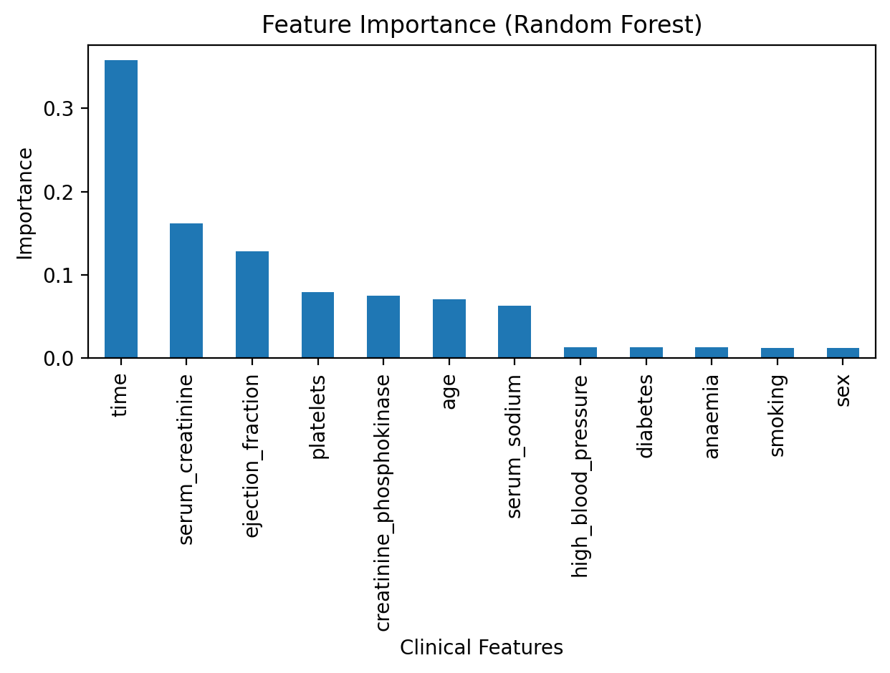
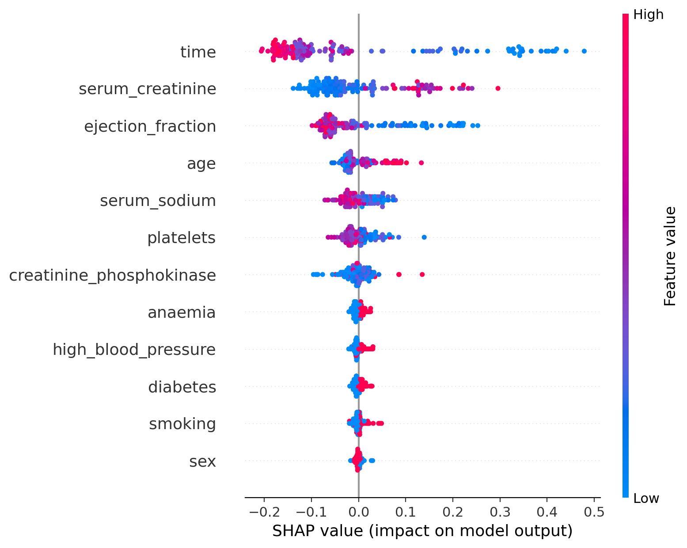

# Heart Failure Mortality Prediction using Machine Learning


---

## Project Summary

This project develops machine learning models to predict mortality risk in patients with heart failure using clinical and laboratory variables.

**Key Results**

* Random Forest achieved **ROC-AUC ≈ 0.90**
* Logistic Regression baseline achieved **ROC-AUC ≈ 0.80**
* The most important predictors were **ejection fraction**, **serum creatinine**, **age**, and **follow-up time**
* Model predictions were interpreted using **SHAP explainability**

The results highlight the role of **cardiac function and kidney function** in predicting mortality among heart failure patients.

---

### Feature Importance



The Random Forest model identifies the most influential clinical predictors of mortality.
Cardiac function (ejection fraction) and kidney function (serum creatinine) are the strongest predictors.
---
## Project Overview

This project develops machine learning models to predict mortality risk in patients with heart failure using clinical and laboratory variables.

The analysis includes exploratory data analysis, predictive modeling, cross-validation, and explainable AI techniques to identify key clinical risk factors.

---
## Research Question

Can machine learning models accurately predict mortality risk among patients with heart failure using routinely collected clinical variables?

Understanding the most influential predictors of mortality may help identify high-risk patients earlier and support clinical decision making.

---

## Dataset

The dataset contains clinical records of 299 patients with heart failure.

Target variable:

DEATH_EVENT  
0 – patient survived  
1 – patient died during follow-up

Key clinical features include:

- age
- ejection_fraction
- serum_creatinine
- serum_sodium
- platelets
- diabetes
- anaemia
- smoking
- high_blood_pressure
- time (follow-up duration)
---

# Model Training
The project trains two models:

### Baseline Model
**Logistic Regression**

- Standardized features
- Balanced class weights
- Provides interpretable baseline performance

### Advanced Model
**Random Forest Classifier**

- 500 decision trees
- Handles nonlinear feature interactions
- Robust to noisy tabular clinical data
---


## Machine Learning Pipeline
The modeling stage follows a structured machine learning workflow:

Data → Modeling → Evaluation → Interpretation
```
Dataset
│
▼
Train / Test Split
(Stratified)
│
▼
Baseline Model
Logistic Regression
│
▼
Advanced Model
Random Forest
│
▼
Model Evaluation
ROC-AUC / PR-AUC
│
▼
Cross-Validation
5-fold Stratified CV
│
▼
Feature Importance
(Random Forest)
│
▼
Model Explainability
SHAP Analysis
```
First, a Logistic Regression model is trained as a baseline to establish a reference level of performance.  
Next, a Random Forest classifier is trained to capture nonlinear relationships between clinical variables.
Model performance is compared using ROC-AUC and PR-AUC metrics.  
To ensure robustness of results, 5-fold stratified cross-validation is applied.
Finally, feature importance analysis is performed to identify the most influential clinical predictors.


## Results

### Model Comparison

| Model | ROC-AUC | PR-AUC |
|------|------|------|
| Logistic Regression | ~0.80 | ~0.65 |
| Random Forest | **~0.90** | **~0.81** |

The Random Forest model outperforms the logistic regression baseline.


### Model Explainability (SHAP)



To interpret model predictions, the project uses **SHAP (SHapley Additive Explanations)**.

SHAP provides both:

- **Global feature importance**
- **Patient-level explanations**

Key predictors identified by the model include:

- **Ejection fraction** (cardiac function)
- **Serum creatinine** (kidney function)
- **Age**
- **Follow-up time**

These predictors align with known clinical mechanisms affecting heart failure prognosis.

---
## Key Takeaways

- Random Forest significantly outperforms the logistic regression baseline.
- Cardiac function (ejection fraction) is the strongest predictor of mortality.
- Kidney function (serum creatinine) also plays a critical role in survival outcomes.
- Explainable AI methods such as SHAP help interpret model predictions at both global and patient levels.

---

## Clinical Insights

The model highlights the importance of the **cardio-renal interaction** in determining patient outcomes.

Key findings include:

- Lower **ejection fraction** is strongly associated with increased mortality risk due to reduced cardiac output.
- Higher **serum creatinine** indicates impaired kidney function and worsened prognosis.
- **Older patients** demonstrate higher predicted mortality risk.
- Disease progression over **shorter follow-up time periods** is associated with worse outcomes.

Overall, the machine learning model captures clinically meaningful relationships between **cardiac function, renal function, and patient survival**.

---

## Project Architecture

The repository is organized to separate data, modeling code, and experiment outputs.
```
DSML_DEMO_PROJECT
│
├── data
│   └── heart_failure_clinical_records_dataset.csv
│
├── notebooks
│   ├── 01_eda.ipynb
│   ├── 02_modeling.ipynb
│   └── 03_explainability.ipynb
│
├── src
│   ├── train.py
│   └── explain.py
│
├── models
│   └── rf.joblib
│
├── reports
│   ├── metrics.json
│   └── figures
│       ├── feature_importance.png
│       ├── shap_summary.png
│       ├── shap_bar.png
│       └── shap_waterfall_patient0.png
│
├── README.md
└── requirements.txt
```

### Directory description

- **data/** – contains the raw dataset used for model training  
- **notebooks/** – exploratory analysis, modeling, and explainability notebooks  
- **src/** – reusable scripts for model training and explainability  
- **models/** – saved trained model artifacts  
- **reports/** – evaluation metrics and generated figures for the project
---

## Quick start
Clone the repository:

```bash
git clone https://github.com/yourusername/DSML_DEMO_PROJECT.git
cd DSML_DEMO_PROJECT
pip install -r requirements.txt
python src/train.py
python src/explain.py
```
---
## Reproducibility
The project ensures reproducibility through:

fixed random seeds

stratified data splitting

cross-validation

dependency specification via requirements.txt

---

## Environment
Python 3.12

Main libraries:

- pandas
- numpy
- scikit-learn
- matplotlib
- seaborn
- shap
---

## Future Improvements
- Hyperparameter optimization
- Testing gradient boosting models
- External dataset validation
- Clinical decision support tool
---

## Why This Project Matters
Machine learning applied to clinical data can help identify high-risk patients earlier and support more informed medical decision-making.
This project demonstrates how predictive modeling and explainable AI can be combined to produce clinically interpretable insights.

